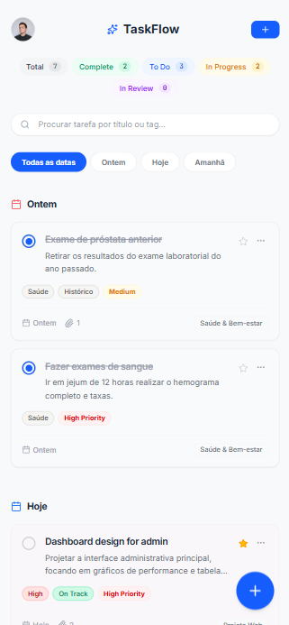
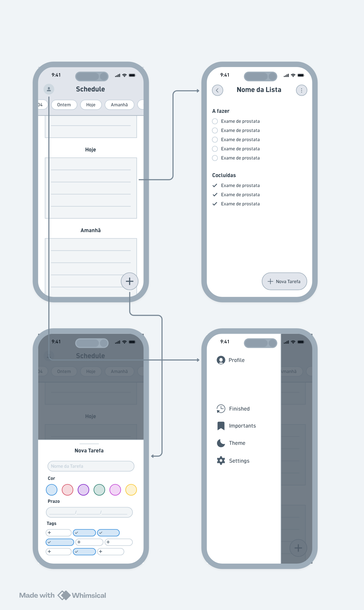

# App TaskFlow

Aplicativo de gestão de tarefas. Inclui sistema de favoritos, tags, tema escuro.

Desenvolvido durante a disciplina:

- Projeto de Interface Web - 2º Ano Técnico em Informática
- Professor: Thiago Guimarães Tavares

## Sobre o Projeto

Foi projetado utilizando Whimiscal como ferramenta de prototipagem para o desenvolvimento do layout de média fidelidade.

Posteriormente foi utilizado o Google Stitch para criar a interface gráfica e identidade visual do aplicativo.

Na sequência foi utilizado o Google AI Studio para criação do aplicativo.

## Rodar Localmente

**Pré-requisitos:**  Node.js

- Clone este repositório e acesse o diretório do projeto

1. Instale as dependências com npm install: `npm install`
2. Para rodar o aplicativo inicie o servidor: `npm run dev`
3. Insira a url informada no  navedor
